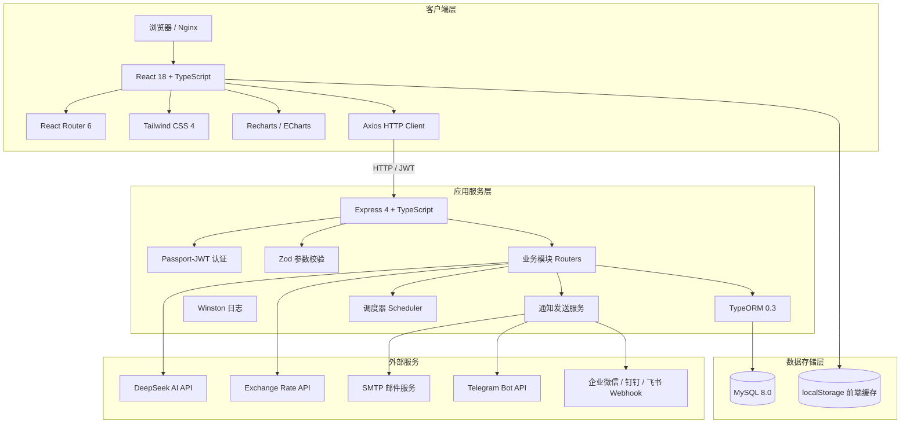
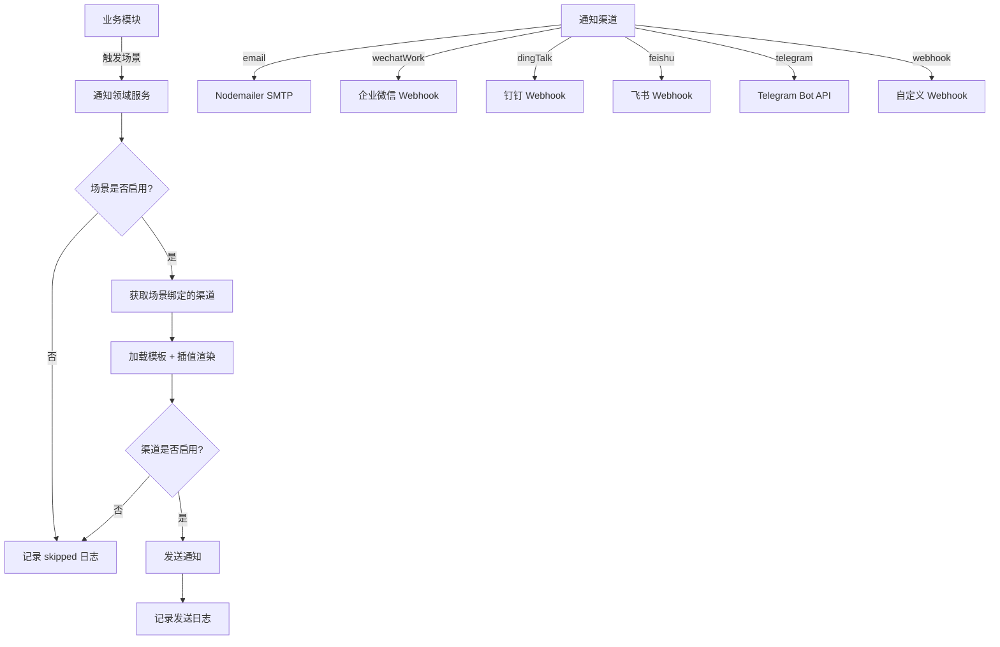
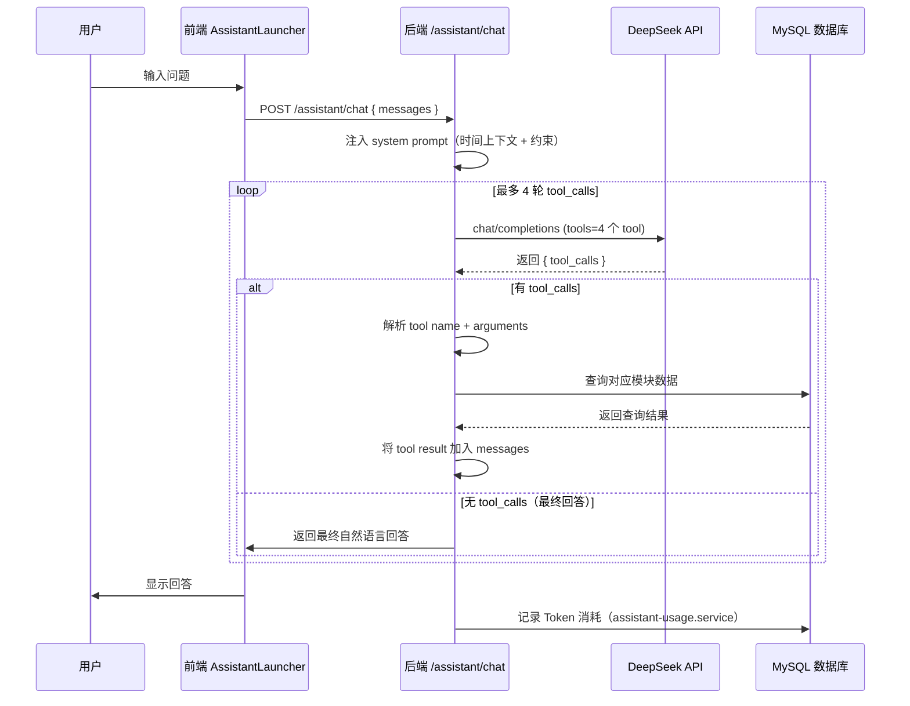
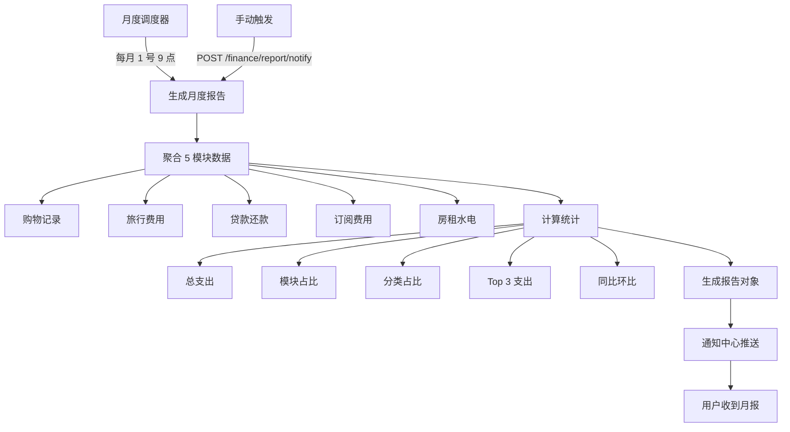

# LifeOS 系统架构文档

> 版本：1.0  
> 最后更新：2026-07-04  
> 适用版本：LifeOS v2.x

---

## 一、系统架构总览

### 1.1 整体架构图

LifeOS 是一个**前后端分离**的全栈 Web 应用，采用经典的三层架构设计。



**数据流示意：**

```
┌─────────────────────────────────────────────────────────────┐
│                      浏览器（前端应用）                       │
│  React 18 + TypeScript  │  React Router 6  │  Tailwind 4   │
└─────────────────────────────────────────────────────────────┘
                          │  HTTP / Axios
                          │  Authorization: Bearer <JWT>
                          ▼
┌─────────────────────────────────────────────────────────────┐
│  Express 4  +  TypeScript  +  Zod  +  Passport-JWT          │
│  ┌──────────────┐  ┌──────────────┐  ┌──────────────┐       │
│  │ auth-mw      │→ │ router 层    │→ │ entity 层    │       │
│  │ (JWT 鉴权)   │  │ (REST + Zod) │  │ (TypeORM)   │       │
│  └──────────────┘  └──────────────┘  └──────────────┘       │
└─────────────────────────────────────────────────────────────┘
                          │  TypeORM / mysql2
                          ▼
                      MySQL 8.0
```

### 1.2 架构设计原则

| 原则 | 说明 | 实践示例 |
|------|------|----------|
| **分层清晰** | 前后端严格分层，职责单一 | 前端：page → component → service → api；后端：router → entity |
| **类型安全** | 全链路 TypeScript 类型保障 | 前后端共享类型定义思路，Zod 运行时校验 |
| **用户数据隔离** | 所有业务数据按 user_id 隔离 | `UserScopedEntity` 基类，查询自动带 user_id |
| **可扩展性** | 模块化设计，新增模块成本低 | 按业务领域划分 modules，统一实体基类 |
| **容错与降级** | 关键路径有降级方案 | API Key 未配置时优雅跳过，三层兜底写入 |
| **开发体验** | 热更新、自动同步、类型提示 | Vite HMR、TypeORM synchronize（开发环境） |
| **统一规范** | 命名、格式、响应结构统一 | 统一 `successResponse` / `AppError` 格式 |

### 1.3 技术选型与决策依据

| 层级 | 技术选型 | 版本 | 选型理由 |
|------|----------|------|----------|
| **前端框架** | React + TypeScript | 18 / 5.7 | 生态成熟，函数式组件 + Hooks 模式灵活 |
| **构建工具** | Vite | 6 | 极快的 HMR，ESM 原生支持，构建优化 |
| **样式方案** | Tailwind CSS 4 + CSS 变量 | 4.3 | 原子化 CSS + 设计 token，开发效率高 |
| **路由** | React Router | 6.28 | 官方推荐，懒加载 + 嵌套路由支持完善 |
| **状态管理** | useSyncExternalStore + localStorage | - | 轻量，避免 Redux 过度设计，满足中小型应用 |
| **HTTP 客户端** | Axios | 1.16 | 拦截器、取消请求、类型支持完善 |
| **图表库** | Recharts + ECharts | 3.8 / 6.1 | Recharts 简单图表 + ECharts 复杂可视化 |
| **后端框架** | Express + TypeScript | 4.21 / 5.7 | 轻量、灵活，中间件生态丰富 |
| **ORM** | TypeORM | 0.3 | Active Record + Data Mapper 双模式，迁移支持好 |
| **数据库** | MySQL + mysql2 | 8 / 3.22 | 成熟稳定，事务支持好，社区资源丰富 |
| **认证** | JWT + Refresh Token | 9 | 无状态，水平扩展容易，双 Token 安全方案 |
| **参数校验** | Zod | 3.24 | TypeScript 优先，类型推断友好，Schema 可复用 |
| **通知发送** | Nodemailer + Fetch | 8 / - | 邮件稳定可靠，Webhook 原生 fetch 即可 |
| **日志** | Winston | 3.19 | 结构化日志，多传输通道 |
| **AI 服务** | DeepSeek | - | 性价比高，function calling 支持好 |
| **TG Bot** | Grammy | 1.43 | TypeScript 友好，中间件模式，社区活跃 |

### 1.4 系统边界与外部依赖

**内部模块边界：**

| 模块域 | 包含子模块 | 数据归属 |
|--------|-----------|----------|
| 健康中心 | 步数、健身、体检、用药 | health_* 表 |
| 财务中心 | 购物、旅行、贷款、订阅、房租、报告、汇率 | finance_* 表 |
| 生活中心 | 物品、号卡、待办 | life_* 表 |
| 投资中心 | 外汇（加密/港股/美股占位） | investment_* 表 |
| 通知中心 | 渠道、场景、模板、日志 | notification_* 表 |
| 系统模块 | 认证、仪表盘、智能助理、健康检查 | system_* 表 |
| Telegram 模块 | Bot、绑定、快速录入 | telegram_* 表 |

**外部依赖：**

| 依赖 | 用途 | 必需性 | 失败降级 |
|------|------|--------|----------|
| DeepSeek API | AI 智能助理、健身 AI 分析、TG 自然语言解析 | 可选 | 功能不可用，返回友好提示 |
| Exchange Rate API v6 | 实时汇率换算 | 可选 | 使用内置 FALLBACK_RATES 离线表 |
| SMTP 服务 | 邮件通知 | 可选 | 邮件渠道发送失败，记录日志 |
| Telegram Bot API | TG 快速录入 Bot | 可选 | Bot 不启动，不影响主系统 |
| 企业微信 / 钉钉 / 飞书 | 通知 Webhook | 可选 | 对应渠道失败，记录日志 |

---

## 二、前端架构

### 2.1 前端技术栈详解

```json
{
  "核心框架": "React 18.3 + TypeScript 5.7",
  "构建工具": "Vite 6.0 + @vitejs/plugin-react",
  "样式": "Tailwind CSS 4.3 + @tailwindcss/vite",
  "路由": "react-router-dom 6.28",
  "HTTP": "axios 1.16",
  "状态管理": "useSyncExternalStore + localStorage",
  "图表": "recharts 3.8 + echarts 6.1",
  "日期": "dayjs 1.11",
  "工具库": "lodash 4.18",
  "文件处理": "xlsx 0.18 + papaparse 5.5 + jspdf 4.2 + html2canvas 1.4",
  "进度条": "nprogress 0.2",
  "Cookie": "js-cookie 3.0",
  "唯一ID": "uuid 14.0"
}
```

**构建配置要点** (`client/vite.config.ts`):

```typescript
export default defineConfig({
  plugins: [react(), tailwindcss()],
  server: {
    host: true,
    port: 3000,
    proxy: {
      '/api': {
        target: 'http://localhost:3100',
        changeOrigin: true,
      },
    },
  },
});
```

### 2.2 目录结构说明

```
client/src/
├── components/               # 组件库
│   ├── ui.tsx               # 基础 UI 组件（Btn/Field/Modal/Table/Tabs 等）
│   ├── page.tsx             # 页面级容器（PageHeader/SectionCard/StatGrid）
│   ├── ErrorBoundary.tsx    # React 错误边界
│   ├── ProtectedRoute.tsx   # 路由守卫组件
│   ├── RouteLoadingFallback.tsx  # 路由加载占位
│   ├── SettingSwitchCard.tsx     # 设置开关卡片
│   ├── NotificationChannelCard.tsx  # 通知渠道卡片
│   ├── NotificationStatusCard.tsx   # 通知状态卡片
│   ├── NotificationLogTable.tsx     # 通知日志表格
│   ├── shared/              # 全局共享组件
│   │   └── AssistantLauncher.tsx  # AI 助理浮动按钮 + 聊天面板
│   ├── date/                # 日期选择器组件
│   ├── finance/             # 财务模块业务组件（~20 个）
│   ├── health/              # 健康模块业务组件（~15 个）
│   ├── investment/          # 投资模块业务组件
│   ├── life/                # 生活模块业务组件（~13 个）
│   ├── notifications/       # 通知中心组件
│   └── settings/            # 设置页组件
├── config/
│   └── navigation.tsx       # 导航菜单配置 + 路由表
├── hooks/
│   ├── useLocalStorageState.ts  # localStorage 状态 Hook
│   ├── usePageTab.ts           # 页面 Tab 切换 Hook
│   └── useTheme.tsx            # 主题切换 Hook（亮/暗模式）
├── layout/
│   └── MainLayout.tsx      # 主布局（侧边栏 + 顶栏 + 内容区）
├── lib/
│   ├── api.ts              # Axios 封装（拦截器/错误处理/Token 刷新）
│   └── chartPalette.ts     # 图表配色方案
├── pages/                   # 页面主组件（路由级别）
│   ├── auth/Login.tsx       # 登录/注册页
│   ├── Dashboard.tsx        # 仪表盘首页
│   ├── health/              # 健康中心 4 个页面
│   ├── finance/             # 财务中心 6 个页面
│   ├── life/                # 生活中心 3 个页面
│   ├── investment/          # 投资中心 4 个页面
│   ├── notifications/       # 通知中心页
│   ├── settings/            # 个人设置页
│   └── shared/              # 共享页面（占位页等）
├── services/                # API 调用层 + 本地业务逻辑（~25 个文件）
│   ├── auth.ts              # 认证服务（状态管理 + API）
│   ├── assistantApi.ts      # AI 助理 API
│   ├── financeReportApi.ts  # 财务报告 API
│   ├── exchangeRateApi.ts   # 汇率换算 API
│   ├── telegramApi.ts       # Telegram 绑定 API
│   └── ...                  # 各业务模块 API 服务
├── types/                   # TypeScript 类型定义（~24 个文件）
│   ├── api.ts               # API 响应/请求通用类型
│   ├── auth.ts              # 认证相关类型
│   ├── navigation.ts        # 导航/路由类型
│   └── ...                  # 各业务模块类型
├── utils/
│   ├── lazyWithProgress.ts  # 懒加载 + NProgress 进度条
│   └── storage.ts           # 存储工具
├── App.tsx                  # 根组件（路由配置）
├── main.tsx                 # 应用入口
└── index.css               # 全局样式（CSS 变量 + 组件样式）
```

### 2.3 组件分层架构

前端采用**四层组件架构**，从上到下依赖关系明确：

```
┌─────────────────────────────────────────┐
│  Layer 4: Page 页面层                   │
│  (pages/*.tsx)                          │
│  路由级别组件，组合业务子组件             │
└─────────────────────────────────────────┘
                    │
                    ▼
┌─────────────────────────────────────────┐
│  Layer 3: Business Section 业务组件层    │
│  (components/finance/*.tsx 等)          │
│  业务模块子组件，处理具体业务逻辑          │
└─────────────────────────────────────────┘
                    │
                    ▼
┌─────────────────────────────────────────┐
│  Layer 2: Page Container 页面容器层     │
│  (components/page.tsx)                  │
│  PageHeader / SectionCard / StatGrid    │
└─────────────────────────────────────────┘
                    │
                    ▼
┌─────────────────────────────────────────┐
│  Layer 1: Base UI 基础 UI 层            │
│  (components/ui.tsx)                    │
│  Btn / Field / Modal / Table / Tabs     │
└─────────────────────────────────────────┘
```

**各层职责说明：**

| 层级 | 文件位置 | 职责 | 示例 |
|------|----------|------|------|
| Page 层 | `pages/` | 路由级页面，状态聚合，子组件组合 | `Dashboard.tsx`, `FinanceReport.tsx` |
| Business Section 层 | `components/<module>/` | 业务子模块，可复用的业务单元 | `ShoppingRecordsSection`, `LoanDashboardSection` |
| Page Container 层 | `components/page.tsx` | 页面布局容器，统一样式规范 | `PageHeader`, `SectionCard`, `StatGrid` |
| Base UI 层 | `components/ui.tsx` | 原子级 UI 组件，无业务逻辑 | `Btn`, `Field`, `Modal`, `Table`, `Toast` |

### 2.4 状态管理策略

LifeOS 采用**轻量级状态管理**方案，避免过度设计：

#### 2.4.1 全局状态：认证状态

**实现方式**：`useSyncExternalStore` + 发布订阅模式 + localStorage 持久化

**核心代码** (`client/src/services/auth.ts`):

```typescript
// 外部存储 + 订阅模式
const listeners = new Set<() => void>();

let authState: AuthState = {
  status: 'booting',       // booting | authenticated | anonymous
  session: readStoredSession(),
  reason: null,
};

function emitChange() {
  listeners.forEach((listener) => listener());
}

function subscribe(listener: () => void) {
  listeners.add(listener);
  return () => listeners.delete(listener);
}

function getSnapshot() {
  return authState;
}

// React Hook
export function useAuthState() {
  return useSyncExternalStore(subscribe, getSnapshot, getSnapshot);
}
```

**状态流转：**

```
booting (初始)
    │
    ├─ 有 session 且 /auth/me 成功 → authenticated
    └─ 无 session 或验证失败 → anonymous
```

#### 2.4.2 页面级状态：React useState / useReducer

各页面内部使用本地 `useState` 管理表单数据、列表数据、弹窗状态等。

#### 2.4.3 本地缓存：localStorage

| 存储 Key | 内容 | 用途 |
|----------|------|------|
| `lifeos_auth_session` | 认证会话（accessToken + refreshToken + user） | 持久化登录状态 |
| 各模块自定义 | 模块特有状态 | 如外汇模块的本地计算状态 |

### 2.5 路由设计与权限控制

#### 2.5.1 路由配置

路由表集中配置在 `client/src/config/navigation.tsx`，包含菜单项和路由定义：

```typescript
export const routes: RouteConfig[] = [
  { path: '/dashboard', label: '首页', breadcrumb: ['首页'], 
    menuKey: '/dashboard', component: Dashboard },
  { path: '/health/step', label: '运动步数', 
    breadcrumb: ['健康中心', '运动步数'], menuKey: '/health/step', 
    component: StepPage },
  // ... 更多路由
];
```

#### 2.5.2 路由守卫

**两层守卫机制**：

```
App.tsx
├── GuestRoute (游客路由，仅未登录可访问)
│   └── /login
└── ProtectedRoute (受保护路由，需登录)
    └── MainLayout
        └── 所有业务路由
```

**`ProtectedRoute` 组件** (`client/src/components/ProtectedRoute.tsx`):
- 检查 `authState.status`
- 未登录时重定向到 `/login`
- 登录态有效时渲染子路由

#### 2.5.3 懒加载策略

所有页面组件通过 `lazyWithProgress` 懒加载：

```typescript
// client/src/utils/lazyWithProgress.ts
export function lazyWithProgress<T extends ComponentType>(
  importer: () => Promise<{ default: T }>,
) {
  return lazy(async () => {
    ensureConfigured();
    NProgress.start();  // 开始进度条
    try {
      const module = await importer();
      NProgress.done();   // 完成进度条
      return module;
    } catch (error) {
      NProgress.done();
      throw error;
    }
  });
}
```

**性能收益**：
- 首屏只加载 Dashboard 相关代码
- 其他页面按需加载，减少初始 bundle 体积
- NProgress 顶部进度条提供视觉反馈

### 2.6 API 调用层封装

#### 2.6.1 统一封装

API 调用统一通过 `client/src/lib/api.ts` 封装，提供 `apiGet` / `apiPost` / `apiPatch` / `apiDelete` 四个函数。

#### 2.6.2 请求拦截器

```typescript
apiClient.interceptors.request.use((config) => {
  const session = getAuthSession();
  if (session?.accessToken) {
    config.headers = config.headers ?? {};
    config.headers.Authorization = `Bearer ${session.accessToken}`;
  }
  return config;
});
```

#### 2.6.3 响应拦截器与 Token 自动刷新

**双 Token 刷新机制**：
- Access Token 有效期短（默认 7 天）
- Refresh Token 有效期长（默认 30 天）
- 401 时自动尝试刷新，刷新失败清除会话

```typescript
// 401 自动重试逻辑
if (error.response?.status !== 401 || !originalRequest 
    || originalRequest.__retried) {
  return Promise.reject(error);
}

const nextToken = await ensureFreshAccessToken();
if (!nextToken) return Promise.reject(error);

originalRequest.__retried = true;
originalRequest.headers.Authorization = `Bearer ${nextToken}`;
return apiClient(originalRequest);
```

#### 2.6.4 统一错误处理

提供多个错误处理工具函数：

| 函数 | 用途 |
|------|------|
| `getApiErrorShape` | 获取完整错误对象 |
| `getApiErrorCode` | 获取错误码 |
| `getApiFieldErrors` | 获取字段级错误（Zod 校验） |
| `getApiFormErrors` | 获取表单级错误 |
| `buildApiErrorMessage` | 构建用户友好的错误消息 |

### 2.7 样式体系（Tailwind + CSS变量 + 设计token）

LifeOS 采用 **Stripe 设计体系**，通过三层样式机制实现：

#### 2.7.1 设计 Token（CSS 变量）

定义在 `client/src/index.css` 的 `:root` 中，包含：

| 类别 | 示例变量 | 数量 |
|------|----------|------|
| 主色调 | `--color-primary`, `--color-primary-hover` | 5+ |
| 文字色 | `--color-ink`, `--color-ink-secondary` | 6+ |
| 背景/表面 | `--color-canvas`, `--color-surface-1~4` | 6+ |
| 边框 | `--color-hairline`, `--color-hairline-input` | 3+ |
| 语义色 | `--color-success`, `--color-danger`, `--color-warning` | 各 3 档 |
| 模块主题色 | `--color-module-step-bg`, `--color-module-finance-ink` | 7 模块 × 2 |
| 字体大小 | `--fs-display` ~ `--fs-overline` | 7 级 + 扩展级 |
| 圆角 | `--radius-sm/md/lg/pill` | 4 级 |
| 布局 | `--sidebar-width-expanded` 等 | - |

#### 2.7.2 暗色模式支持

通过 `[data-theme="dark"]` 选择器覆盖变量：

```css
[data-theme="dark"] {
  --color-canvas: #0a0b10;
  --color-surface: #16181e;
  --color-ink: #f0f1f5;
  /* ... 更多暗色变量 */
}
```

主题切换由 `useTheme` Hook 管理，状态存储在 localStorage。

#### 2.7.3 Tailwind CSS 4 集成

通过 `@tailwindcss/vite` 插件集成，在 CSS 中使用 `@import "tailwindcss";` 引入。

#### 2.7.4 字体层级

| Token | 大小 | 用途 |
|-------|------|------|
| `--fs-mega` | 48px | 巨型数字（步数/收益） |
| `--fs-display` | 36px | 页面主标题 |
| `--fs-heading` | 24px | 分区标题 |
| `--fs-title` | 20px | 卡片/模块标题 |
| `--fs-body` | 16px | 正文/按钮 |
| `--fs-label` | 14px | 表单 label/表头/描述 |
| `--fs-caption` | 13px | 注释/元数据 |
| `--fs-overline` | 11px | Pill 标签/Badge |

### 2.8 性能优化策略

| 优化点 | 实现方式 | 效果 |
|--------|----------|------|
| **路由懒加载** | `React.lazy` + `lazyWithProgress` | 减少首屏 bundle 体积 |
| **NProgress 进度条** | 路由切换时顶部进度条 | 提升感知性能 |
| **Vite 构建优化** | 生产构建代码分割、tree-shaking | 减小产物体积 |
| **请求缓存** | 仪表盘 30 秒内存缓存 | 降低数据库压力 |
| **汇率缓存** | 1 小时进程内缓存 | 减少外部 API 调用 |
| **虚拟列表** | （大数据量时可扩展） | 长列表性能 |
| **React 优化** | `useMemo` / `useCallback` 合理使用 | 避免不必要重渲染 |
| **图表懒渲染** | 进入视口才初始化 | 首屏更快 |
| **localStorage 缓存** | 认证状态、模块本地状态 | 减少重复请求 |

---

## 三、后端架构

### 3.1 后端技术栈详解

```json
{
  "核心框架": "Express 4.21 + TypeScript 5.7",
  "ORM": "TypeORM 0.3.24",
  "数据库驱动": "mysql2 3.22",
  "认证": "jsonwebtoken 9.0 + passport-jwt 4.0",
  "密码哈希": "bcrypt 6.0 + argon2 0.44",
  "参数校验": "zod 3.24",
  "日志": "winston 3.19",
  "邮件": "nodemailer 8.0",
  "文件处理": "exceljs 4.4 + multer 2.1",
  "安全": "helmet 8.2 + cors 2.8 + compression 1.8",
  "配置": "dotenv 17.4 + zod 校验",
  "日期": "dayjs 1.11",
  "工具库": "lodash 4.17",
  "Telegram Bot": "grammy 1.43",
  "唯一ID": "uuid 14.0"
}
```

### 3.2 目录结构说明

```
server/src/
├── config/
│   └── env.ts                 # 环境变量加载与 Zod 校验
├── db/
│   ├── data-source.ts         # TypeORM 数据源配置
│   ├── bootstrap.ts           # 数据库启动初始化
│   ├── seed.ts                # 种子数据
│   └── migrations/            # 数据库迁移文件
├── modules/                   # 业务模块（按领域划分）
│   ├── system/                # 系统模块
│   │   ├── entities/          # system_* 实体（4 个）
│   │   ├── auth.router.ts     # 认证路由
│   │   ├── dashboard.router.ts   # 仪表盘路由
│   │   ├── assistant.router.ts    # AI 助理路由
│   │   ├── assistant.tools.ts     # AI 助理工具实现
│   │   ├── assistant-usage.service.ts  # Token 消耗统计
│   │   ├── analysis.router.ts   # AI 分析路由
│   │   └── system-health.ts    # 健康检查
│   ├── health/                # 健康中心
│   │   ├── entities/          # health_* 实体（~16 个）
│   │   ├── step.router.ts     # 步数
│   │   ├── fitness.router.ts  # 健身
│   │   ├── medication.router.ts  # 用药
│   │   ├── checkup.router.ts  # 体检
│   │   └── fitness-ai.service.ts  # 健身 AI 分析
│   ├── finance/               # 财务中心
│   │   ├── entities/          # finance_* 实体（~20 个）
│   │   ├── shopping.router.ts # 购物
│   │   ├── travel.router.ts   # 旅行
│   │   ├── loan.router.ts     # 贷款
│   │   ├── subscription.router.ts  # 订阅
│   │   ├── rent.router.ts     # 房租
│   │   ├── finance-report.router.ts  # 财务报告
│   │   ├── finance-report.scheduler.ts  # 月报调度器
│   │   ├── finance-followup.scheduler.ts  # 跟进调度器
│   │   └── exchange-rate.router.ts  # 汇率换算
│   ├── investment/            # 投资中心
│   │   ├── entities/          # investment_* 实体（4 个）
│   │   └── forex.router.ts    # 外汇
│   ├── life/                  # 生活中心
│   │   ├── entities/          # life_* 实体（~10 个）
│   │   ├── todo.router.ts     # 待办
│   │   ├── storage.router.ts  # 物品
│   │   ├── card.router.ts     # 号卡
│   │   └── todo-recurrence.ts # 重复任务计算
│   ├── notifications/         # 通知中心
│   │   ├── entities/          # notification_* 实体（5 个）
│   │   └── notification-center.router.ts
│   └── telegram/              # Telegram 快速录入
│       ├── entities/          # telegram_* 实体
│       ├── telegram.bot.ts    # Bot 主逻辑
│       ├── telegram.router.ts # 绑定 API
│       ├── services/          # 解析/绑定服务
│       └── commands/          # 命令处理器（7 个）
├── routes/
│   └── index.ts               # 路由注册中心
├── shared/                    # 共享基础设施
│   ├── db/
│   │   └── base-user-setting.service.ts
│   ├── domain/
│   │   └── notification.ts    # 通知领域服务
│   ├── errors/
│   │   └── app-error.ts       # 统一错误类
│   ├── http/
│   │   ├── async-handler.ts   # 异步错误捕获
│   │   ├── auth-middleware.ts # JWT 认证中间件
│   │   ├── error-handler.ts   # 全局错误处理
│   │   ├── request.ts         # 请求工具
│   │   ├── response.ts        # 统一响应格式
│   │   └── validation.ts      # Zod 校验中间件
│   ├── persistence/           # 基础实体类
│   │   ├── timestamped.entity.ts
│   │   ├── user-scoped.entity.ts
│   │   ├── user-setting.entity.ts
│   │   └── import-batch.entity.ts
│   ├── services/
│   │   └── notification-sender.ts  # 通知发送实现
│   └── utils/
│       ├── date.ts
│       ├── number.ts
│       ├── pagination.ts
│       └── text.ts
├── types/
│   └── bcrypt.d.ts
├── app.ts                     # Express 应用创建
└── index.ts                   # 服务启动入口
```

### 3.3 分层架构（Router/Service/Entity/Middleware）

后端采用**经典三层架构**，轻量 Service 层（简单模块可省略）：

```
┌─────────────────────────────────────────┐
│  Middleware 层                           │
│  ┌─────────┐  ┌─────────┐  ┌─────────┐ │
│  │  CORS   │  │ Helmet  │  │  JWT    │ │
│  │Compress │  │  JSON   │  │ Auth    │ │
│  └─────────┘  └─────────┘  └─────────┘ │
└─────────────────────────────────────────┘
                    │
                    ▼
┌─────────────────────────────────────────┐
│  Router 层（薄控制器）                   │
│  - 路由定义                              │
│  - Zod 参数校验                          │
│  - 调用 Service / Repository            │
│  - 返回统一响应                          │
└─────────────────────────────────────────┘
                    │
                    ▼
┌─────────────────────────────────────────┐
│  Service 层（可选，复杂业务）             │
│  - 业务逻辑编排                          │
│  - 多实体事务                            │
│  - 外部服务调用封装                      │
└─────────────────────────────────────────┘
                    │
                    ▼
┌─────────────────────────────────────────┐
│  Entity / Repository 层                  │
│  - TypeORM 实体定义                      │
│  - 数据库 CRUD                          │
│  - 继承基类（Timestamped/UserScoped）   │
└─────────────────────────────────────────┘
```

**设计特点**：
- **Router 薄**：只做参数校验 + 调用 + 返回
- **Service 可选**：简单 CRUD 直接在 Router 中操作 Repository
- **Entity 继承**：通过基类复用公共字段和行为
- **统一入口**：所有路由通过 `routes/index.ts` 集中注册

### 3.4 请求处理流水线

```
客户端请求
    │
    ▼
┌──────────────────┐
│  Helmet          │  安全 HTTP 头
└──────────────────┘
    │
    ▼
┌──────────────────┐
│  CORS            │  跨域处理
└──────────────────┘
    │
    ▼
┌──────────────────┐
│  Compression     │  响应压缩
└──────────────────┘
    │
    ▼
┌──────────────────┐
│  JSON Parser     │  请求体解析（4MB limit）
└──────────────────┘
    │
    ▼
┌──────────────────┐
│  路由匹配         │  /api/*
└──────────────────┘
    │
    ├─ /auth/* / /system/health  →  免鉴权
    │
    └─ 其他路由 → requireJwtAuth 中间件
              │
              ▼
        ┌──────────────────┐
        │  JWT 验证         │  解析 userId 到 request.auth
        └──────────────────┘
              │
              ▼
        ┌──────────────────┐
        │  Zod 校验         │  validateBody / validateQuery
        └──────────────────┘
              │
              ▼
        ┌──────────────────┐
        │  Router Handler  │  业务逻辑
        └──────────────────┘
              │
              ▼
        ┌──────────────────┐
        │  successResponse │  统一返回格式
        └──────────────────┘
              │
              ▼
        错误 → errorHandler 中间件 → 统一错误格式
```

**关键中间件说明**：

| 中间件 | 位置 | 职责 |
|--------|------|------|
| `helmet` | 最外层 | 安全相关 HTTP 头 |
| `cors` | - | 跨域资源共享 |
| `compression` | - | Gzip 响应压缩 |
| `express.json` | - | JSON 请求体解析（limit: 4MB） |
| `requireJwtAuth` | 受保护路由前 | JWT 令牌验证，注入 `request.auth` |
| `validateBody` / `validateQuery` | 路由内 | Zod Schema 校验 |
| `asyncHandler` | 所有路由处理器 | 捕获异步错误，传递给 errorHandler |
| `errorHandler` | 最外层 | 统一错误格式返回 |

### 3.5 认证与授权机制

#### 3.5.1 双 Token 方案

| Token 类型 | 有效期 | 存储位置 | 用途 |
|-----------|--------|----------|------|
| Access Token | 7 天（默认） | localStorage | API 请求认证 |
| Refresh Token | 30 天（默认） | localStorage | 刷新 Access Token |

#### 3.5.2 认证流程

```
登录 (/auth/login)
    │
    ├─ 验证用户名密码（bcrypt 哈希比对）
    ├─ 生成 Access Token（JWT，sub=userId）
    ├─ 生成 Refresh Token（存储在 system_auth_session 表）
    └─ 返回两个 Token + 用户信息

API 请求
    │
    ├─ 携带 Authorization: Bearer <accessToken>
    ├─ requireJwtAuth 中间件验证
    └─ 成功 → 注入 request.auth.userId

Token 过期 (401)
    │
    ├─ 前端拦截器检测 401
    ├─ 调用 /auth/refresh 刷新
    ├─ 成功 → 更新 Access Token，重试原请求
    └─ 失败 → 清除会话，跳转登录
```

#### 3.5.3 JWT Payload 结构

```typescript
interface JwtPayload {
  sub: string;        // 用户 ID
  username?: string;  // 用户名
  type?: 'access' | 'refresh';
}
```

### 3.6 错误处理体系

#### 3.6.1 统一错误类

```typescript
// server/src/shared/errors/app-error.ts
export class AppError extends Error {
  statusCode: number;  // HTTP 状态码
  code: number;        // 业务错误码
  details?: unknown;   // 详细错误信息

  constructor(message: string, statusCode = 400, code = statusCode, details?: unknown) {
    super(message);
    this.name = 'AppError';
    this.statusCode = statusCode;
    this.code = code;
    this.details = details;
  }
}
```

#### 3.6.2 全局错误处理中间件

```typescript
// server/src/shared/http/error-handler.ts
export function errorHandler(error: unknown, _request: Request, response: Response, _next: NextFunction) {
  if (error instanceof AppError) {
    response.status(error.statusCode).json({
      code: error.code,
      message: error.message,
      data: error.details ?? null,
    });
    return;
  }
  // 未知错误 → 500
  response.status(500).json({
    code: 500,
    message: error instanceof Error ? error.message : 'internal_server_error',
    data: null,
  });
}
```

#### 3.6.3 统一响应格式

**成功响应：**
```json
{
  "code": 0,
  "message": "ok",
  "data": { ... }
}
```

**失败响应：**
```json
{
  "code": 401,
  "message": "unauthorized",
  "data": null
}
```

**列表响应：**
```json
{
  "code": 0,
  "message": "ok",
  "data": {
    "items": [...],
    "page": 1,
    "page_size": 10,
    "total": 100,
    "totalPages": 10
  }
}
```

#### 3.6.4 异步错误捕获

`asyncHandler` 包装所有路由处理器，确保异步错误被正确捕获：

```typescript
export function asyncHandler(
  handler: (request: Request, response: Response, next: NextFunction) => Promise<unknown>,
) {
  return (request: Request, response: Response, next: NextFunction) => {
    Promise.resolve(handler(request, response, next)).catch((error) => {
      next(error);
    });
  };
}
```

### 3.7 日志系统

使用 **Winston** 作为日志框架（配置中），当前启动阶段使用 `console.log`。

**日志分级**（规划）：
- `error`：错误日志
- `warn`：警告日志
- `info`：常规信息
- `debug`：调试信息

**日志输出目标**（规划）：
- Console：开发环境
- File：生产环境（按日期切割）

### 3.8 数据库访问层设计

#### 3.8.1 TypeORM 配置

```typescript
// server/src/db/data-source.ts
export const appDataSource = new DataSource({
  type: 'mysql',
  host: env.DB_HOST,
  port: env.DB_PORT,
  username: env.DB_USERNAME,
  password: env.DB_PASSWORD,
  database: env.DB_DATABASE,
  synchronize: env.DB_SYNCHRONIZE,  // 开发环境 true，生产 false
  entities: [`${currentDir}/../modules/**/entities/*.entity.{ts,js}`],
  migrations: [`${currentDir}/migrations/*.{ts,js}`],
});
```

**特点**：
- Entity 自动发现：glob 模式加载所有 `*.entity.ts`
- 开发环境自动同步表结构（`synchronize: true`）
- 生产环境使用 migration 管理表结构

#### 3.8.2 基础实体继承体系

```
TimestampedEntity
  ├── id (UUID, 主键)
  ├── created_at (datetime)
  ├── updated_at (datetime)
  └── deleted_at (datetime, 软删除)
       │
       └── UserScopedEntity
             └── user_id (varchar(36))
                  │
                  └── 各业务实体
```

**`TimestampedEntity`**：
- 所有实体的基类
- 提供主键、创建时间、更新时间、软删除字段
- 主键使用 UUID（`randomUUID()` 生成）

**`UserScopedEntity`**：
- 继承自 `TimestampedEntity`
- 增加 `user_id` 字段，实现用户数据隔离
- 所有业务数据实体都继承此类

**`UserSettingEntity`**：
- 继承自 `UserScopedEntity`
- 用于用户设置表，每个用户一条记录

**`ImportBatchEntity`**：
- 继承自 `UserScopedEntity`
- 用于导入批次跟踪

#### 3.8.3 Repository 使用模式

在 Router 中直接获取 Repository：

```typescript
const repo = appDataSource.getRepository(FinanceShoppingRecordEntity);

// 查询
const records = await repo.find({
  where: { user_id: userId, date: Between(start, end) },
  order: { date: 'DESC' },
});

// 创建
const record = repo.create({ user_id: userId, ...payload });
await repo.save(record);
```

---

## 四、数据库架构

### 4.1 数据库选型

| 项目 | 选型 | 版本 |
|------|------|------|
| 主数据库 | MySQL | 8.0+ |
| 驱动 | mysql2 | 3.22 |
| ORM | TypeORM | 0.3.24 |
| 字符集 | utf8mb4 | - |
| 排序规则 | utf8mb4_unicode_ci | - |

**选型理由**：
- MySQL 成熟稳定，事务支持完善
- utf8mb4 支持完整的 Unicode（包括 emoji）
- TypeORM 提供良好的类型安全和迁移支持

### 4.2 表设计规范

#### 4.2.1 命名规范

| 类别 | 规范 | 示例 |
|------|------|------|
| 表名 | `{模块}_{业务名}`，蛇形命名 | `finance_shopping_record` |
| 字段名 | 蛇形命名 | `user_id`, `created_at` |
| 主键 | `id`，UUID v4 | - |
| 外键 | `{关联表}_id` | `ledger_id`, `platform_id` |
| 索引 | `idx_{表}_{字段}` | `idx_shopping_user_date` |
| 唯一索引 | `uk_{表}_{字段}` | `uk_user_username` |

#### 4.2.2 字段类型规范

| 数据类型 | 适用场景 | 示例字段 |
|----------|----------|----------|
| `varchar(36)` | UUID 主键、外键 | `id`, `user_id` |
| `varchar(64)` | 短文本（用户名、名称） | `username`, `platform` |
| `varchar(128)` | 中等文本 | `item_name`, `email` |
| `varchar(255)` | 较长文本 | `note`, `title` |
| `text` | 长文本（大段描述） | `description`, `html_body` |
| `decimal(12,2)` | 金额、价格 | `price`, `amount` |
| `decimal(10,2)` | 体重等精度稍低的小数 | `weight` |
| `int` | 整数计数 | `steps`, `count` |
| `tinyint(1)` | 布尔值 | `is_active`, `enabled` |
| `date` | 日期（年月日） | `date`, `move_in_date` |
| `datetime` | 时间戳（精确到秒） | `created_at`, `due_date` |
| `enum` | 有限枚举值 | `status`, `priority` |

#### 4.2.3 索引策略

| 索引类型 | 使用场景 | 示例 |
|----------|----------|------|
| 主键索引 | 所有表的 `id` 字段 | 自动创建 |
| 唯一索引 | 用户名、邮箱等唯一字段 | `username`, `email` |
| 普通索引 | 查询条件常用字段 | `user_id + date` 组合索引 |
| 外键索引 | 关联查询字段 | `ledger_id`, `platform_id` |

**索引设计原则**：
- `user_id` 几乎是所有业务表的查询条件，建议建索引
- 日期范围查询频繁的字段建议建索引
- 组合索引遵循最左前缀原则

#### 4.2.4 软删除机制

所有业务表继承 `TimestampedEntity`，包含 `deleted_at` 字段实现软删除：

- 正常记录：`deleted_at IS NULL`
- 已删除记录：`deleted_at` 有值
- TypeORM 的 `@DeleteDateColumn` 自动处理软删除查询过滤

### 4.3 实体关系概览

系统共 **约 41 张表**，按业务模块划分为 8 组：

#### 4.3.1 系统模块（4 张表）

| 表名 | 说明 | 关键字段 |
|------|------|----------|
| `system_user_account` | 用户账号 | `username`, `password_hash`, `email`, `is_active` |
| `system_user_profile` | 用户资料 | `user_id`, `nickname`, `avatar_url`, `timezone` |
| `system_auth_session` | 认证会话 | `user_id`, `refresh_token`, `expires_at` |
| `system_assistant_usage_logs` | AI 助理使用日志 | `user_id`, `prompt_tokens`, `completion_tokens`, `estimated_cost` |

#### 4.3.2 健康中心（~16 张表）

| 子模块 | 表名 | 说明 |
|--------|------|------|
| 步数 | `health_step_record` | 步数记录 |
| | `health_step_setting` | 步数设置 |
| 健身 | `health_fitness_weight_record` | 体重记录 |
| | `health_fitness_diet_record` | 饮食记录 |
| | `health_fitness_exercise_record` | 运动记录 |
| | `health_fitness_shopping_record` | 健身购物记录 |
| | `health_fitness_setting` | 健身设置 |
| 用药 | `health_medication_record` | 用药记录 |
| | `health_medication_purchase` | 购药记录 |
| | `health_medication_threshold` | 用药阈值 |
| | `health_medication_summary` | 用药汇总 |
| | `health_medication_setting` | 用药设置 |
| 体检 | `health_checkup_template` | 体检模板 |
| | `health_checkup_template_item` | 模板项 |
| | `health_checkup_record` | 体检记录 |
| | `health_checkup_setting` | 体检设置 |
| AI 缓存 | `health_food_nutrition_cache` | 食物营养缓存 |
| | `health_exercise_calorie_cache` | 运动热量缓存 |

#### 4.3.3 财务中心（~20 张表）

| 子模块 | 表名 | 说明 |
|--------|------|------|
| 购物 | `finance_shopping_platform` | 购物平台 |
| | `finance_shopping_ledger` | 购物账本 |
| | `finance_shopping_record` | 购物记录 |
| | `finance_shopping_import_batch` | 导入批次 |
| | `finance_shopping_setting` | 购物设置 |
| 旅行 | `finance_travel_book` | 旅行账本 |
| | `finance_travel_expense_record` | 费用记录 |
| | `finance_travel_pay_channel` | 支付渠道 |
| | `finance_travel_import_batch` | 导入批次 |
| | `finance_travel_setting` | 旅行设置 |
| 贷款 | `finance_loan_platform` | 贷款平台 |
| | `finance_loan_repayment` | 还款记录 |
| | `finance_loan_bill` | 账单 |
| | `finance_loan_setting` | 贷款设置 |
| 订阅 | `finance_subscription_category` | 订阅分类 |
| | `finance_subscription_record` | 订阅记录 |
| | `finance_subscription_setting` | 订阅设置 |
| 房租 | `finance_rent_channel` | 租房渠道 |
| | `finance_rent_record` | 租房记录 |
| | `finance_rent_utility_bill` | 水电费账单 |
| | `finance_rent_setting` | 房租设置 |

#### 4.3.4 生活中心（~10 张表）

| 子模块 | 表名 | 说明 |
|--------|------|------|
| 待办 | `life_todo_task` | 待办任务 |
| | `life_todo_setting` | 待办设置 |
| 物品 | `life_storage_item` | 储物物品 |
| | `life_storage_setting` | 储物设置 |
| 号卡 | `life_card_record` | 号卡记录 |
| | `life_card_carrier` | 运营商 |
| | `life_card_recharge_record` | 充值记录 |
| | `life_card_bill_record` | 账单记录 |
| | `life_card_bill_import_batch` | 账单导入批次 |
| | `life_card_setting` | 号卡设置 |

#### 4.3.5 投资中心（4 张表）

| 子模块 | 表名 | 说明 |
|--------|------|------|
| 外汇 | `investment_forex_trade_record` | 交易记录 |
| | `investment_forex_capital_flow` | 资金流水 |
| | `investment_forex_import_batch` | 导入批次 |
| | `investment_forex_setting` | 外汇设置 |

#### 4.3.6 通知中心（5 张表）

| 表名 | 说明 | 关键字段 |
|------|------|----------|
| `notification_center_channel` | 通知渠道 | `type`, `config`, `enabled` |
| `notification_center_scene` | 通知场景 | `scene_id`, `enabled`, `label` |
| `notification_center_scene_channel` | 场景-渠道绑定 | `scene_id`, `channel_type` |
| `notification_center_template` | 通知模板 | `scene_id`, `title`, `body`, `html_body` |
| `notification_center_log` | 发送日志 | `scene_id`, `channel_type`, `status`, `error_message` |

#### 4.3.7 Telegram 模块（1 张表）

| 表名 | 说明 | 关键字段 |
|------|------|----------|
| `telegram_binding` | Telegram 绑定 | `user_id`, `telegram_user_id`, `chat_id`, `bind_code` |

### 4.4 数据迁移策略

#### 4.4.1 开发环境：自动同步

```typescript
// DB_SYNCHRONIZE 在开发环境默认为 true
DB_SYNCHRONIZE: parsedEnv.DB_SYNCHRONIZE === undefined
  ? !isProduction
  : parsedEnv.DB_SYNCHRONIZE === 'true',
```

- 开发环境下 TypeORM 自动同步表结构
- 快速迭代，无需手动写迁移
- **生产环境必须关闭**

#### 4.4.2 生产环境：TypeORM Migrations

**相关命令**：

```bash
# 生成迁移文件
npm run migration:generate

# 执行迁移
npm run migration:run

# 回滚迁移
npm run migration:revert
```

**迁移文件位置**：`server/src/db/migrations/`

#### 4.4.3 自动补齐机制（Seed on Read）

对于通知场景、模板等配置类数据，采用**首次读取时自动补齐**策略：

- 用户首次访问通知中心时，自动创建默认的场景和模板
- 系统升级新增场景时，下次 GET 时自动补齐
- 无需手动跑 seed 脚本，用户无感知

#### 4.4.4 兜底建表机制

对于 AI 使用日志等关键表，实现了**三层兜底写入**：

1. 正常使用 TypeORM Repository.insert
2. 失败时回退到原生 SQL INSERT
3. 表不存在时执行 CREATE TABLE IF NOT EXISTS 后重试

```typescript
// 伪代码示意
async function recordAssistantUsage(...) {
  try {
    await repo.insert(log);  // 第一层：ORM
  } catch {
    try {
      await dataSource.query(sql);  // 第二层：原生 SQL
    } catch {
      await dataSource.query(createTableSql);  // 第三层：建表
      await dataSource.query(sql);  // 重试
    }
  }
}
```

---

## 五、部署架构

### 5.1 部署方式

#### 5.1.1 推荐部署架构

```
                    ┌─────────────┐
                    │   用户浏览器  │
                    └──────┬──────┘
                           │ HTTPS
                           ▼
                    ┌─────────────┐
                    │   Nginx     │  ← 静态资源 + 反向代理
                    │  (SSL 终止) │
                    └──┬───────┬──┘
                       │       │
               静态资源 │       │ /api 反向代理
         client/dist/  │       │
                       ▼       ▼
                  ┌───────────────────┐
                  │  Node.js (Express)│  ← PM2 / systemd 守护
                  │   端口 3100       │
                  └─────────┬─────────┘
                            │
                            ▼
                  ┌───────────────────┐
                  │   MySQL 8.0       │  ← 独立数据库服务器
                  │   端口 3306       │
                  └───────────────────┘
```

#### 5.1.2 前后端部署步骤

**前端构建与部署**：
```bash
cd client
npm install
npm run build
# 产物在 client/dist，由 Nginx 托管
```

**后端构建与部署**：
```bash
cd server
npm install
npm run build
# 运行迁移
npm run migration:run
# 启动服务
npm start
```

### 5.2 环境变量配置

环境变量定义在 `server/.env`，使用 Zod Schema 进行类型校验。

#### 5.2.1 完整环境变量清单

| 变量 | 必填 | 默认值 | 说明 |
|------|------|--------|------|
| **基础配置** | | | |
| `PORT` | 否 | 3100 | 后端服务端口 |
| `NODE_ENV` | 否 | development | 运行环境（development/test/production） |
| **JWT 配置** | | | |
| `JWT_SECRET` | **是** | replace_me | JWT 签名密钥（生产必须修改） |
| `JWT_EXPIRES_IN` | 否 | 7d | Access Token 过期时间 |
| `REFRESH_TOKEN_EXPIRES_IN` | 否 | 30d | Refresh Token 过期时间 |
| **数据库配置** | | | |
| `DB_HOST` | 是 | 127.0.0.1 | 数据库地址 |
| `DB_PORT` | 否 | 3306 | 数据库端口 |
| `DB_USERNAME` | 是 | root | 数据库用户名 |
| `DB_PASSWORD` | 是 | root | 数据库密码 |
| `DB_DATABASE` | 是 | lifeos | 数据库名 |
| `DB_SYNCHRONIZE` | 否 | 开发=true/生产=false | 自动同步表结构（生产必须 false） |
| `DB_AUTO_BOOTSTRAP` | 否 | 开发=true/生产=false | 自动启动初始化 |
| **DeepSeek AI 配置** | | | |
| `DEEPSEEK_API_KEY` | 否 | - | DeepSeek API 密钥 |
| `DEEPSEEK_BASE_URL` | 否 | https://api.deepseek.com | DeepSeek API 基础 URL |
| **汇率 API 配置** | | | |
| `EXCHANGE_RATE_API_KEY` | 否 | - | Exchange Rate API v6 密钥 |
| `EXCHANGE_RATE_API_BASE_URL` | 否 | https://v6.exchangerate-api.com/v6 | 汇率 API 地址 |
| **SMTP 邮件配置** | | | |
| `SMTP_HOST` | 否 | smtp.example.com | SMTP 服务器地址 |
| `SMTP_PORT` | 否 | 587 | SMTP 端口 |
| `SMTP_SECURE` | 否 | false | 是否使用 SSL（465 端口设为 true） |
| `SMTP_USER` | 否 | - | SMTP 用户名 |
| `SMTP_PASS` | 否 | - | SMTP 密码 |
| `SMTP_FROM` | 否 | noreply@example.com | 发件人邮箱 |
| **Telegram Bot 配置** | | | |
| `TELEGRAM_BOT_TOKEN` | 否 | - | Telegram Bot Token |
| `TELEGRAM_API_ROOT` | 否 | - | 自定义 API 根地址（国内反代） |

#### 5.2.2 环境变量校验

使用 Zod 在启动时校验环境变量：

```typescript
// server/src/config/env.ts
const envSchema = z.object({
  NODE_ENV: z.enum(['development', 'test', 'production']).default('development'),
  PORT: z.coerce.number().int().positive().default(3100),
  JWT_SECRET: z.string().min(1).default('replace_me'),
  // ... 更多字段校验
});

const parsedEnv = envSchema.parse(process.env);
```

**校验失败时**：服务启动失败，输出错误信息，避免配置错误导致的运行时问题。

### 5.3 生产环境建议

#### 5.3.1 安全建议

| 类别 | 建议 | 重要性 |
|------|------|--------|
| JWT 密钥 | 使用随机字符串，至少 32 位 | 🔴  critical |
| 数据库密码 | 强密码，定期更换 | 🔴  critical |
| HTTPS | 全站 HTTPS，配置 HSTS | 🔴  critical |
| 数据库访问 | 限制 IP 白名单，不对外开放 | 🟡  high |
| 备份 | 定期数据库备份（每日 + 异地） | 🔴  critical |
| DB_SYNCHRONIZE | 生产环境必须设为 false | 🔴  critical |
| CORS | 限制允许的 origin | 🟡  high |
| 请求限流 | 配置速率限制（登录、注册等接口） | 🟡  high |

#### 5.3.2 性能建议

| 类别 | 建议 |
|------|------|
| 静态资源 | Nginx gzip 压缩 + 浏览器缓存 |
| 数据库 | 连接池调优、慢查询监控、索引优化 |
| 进程管理 | PM2 多进程模式，充分利用多核 CPU |
| CDN | 静态资源走 CDN 加速 |
| 监控 | 接入 APM 监控（如 Sentry、OpenTelemetry） |

#### 5.3.3 高可用建议

| 组件 | 建议方案 |
|------|----------|
| 应用服务器 | 多实例部署 + 负载均衡 |
| 数据库 | 主从复制 + 读写分离 |
| 备份 | 定时全量备份 + 增量备份 |
| 监控告警 | 服务可用性监控 + 异常告警 |

#### 5.3.4 Nginx 配置参考

```nginx
server {
    listen 443 ssl http2;
    server_name lifeos.example.com;

    ssl_certificate /path/to/cert.pem;
    ssl_certificate_key /path/to/key.pem;

    # 前端静态资源
    root /path/to/client/dist;
    index index.html;

    location / {
        try_files $uri $uri/ /index.html;
    }

    # 后端 API 反向代理
    location /api/ {
        proxy_pass http://127.0.0.1:3100;
        proxy_set_header Host $host;
        proxy_set_header X-Real-IP $remote_addr;
        proxy_set_header X-Forwarded-For $proxy_add_x_forwarded_for;
        proxy_set_header X-Forwarded-Proto $scheme;
    }

    # 静态资源缓存
    location ~* \.(js|css|png|jpg|jpeg|gif|ico|svg)$ {
        expires 1y;
        add_header Cache-Control "public, immutable";
    }
}
```

#### 5.3.5 PM2 配置参考

```javascript
// ecosystem.config.js
module.exports = {
  apps: [{
    name: 'lifeos-server',
    script: 'dist/index.js',
    instances: 'max',
    exec_mode: 'cluster',
    env: {
      NODE_ENV: 'production',
    },
    error_file: './logs/error.log',
    out_file: './logs/out.log',
    log_date_format: 'YYYY-MM-DD HH:mm:ss',
  }],
};
```

---

## 六、关键模块架构详解

### 6.1 通知中心架构

通知中心是 LifeOS 的**统一告警与提醒基础设施**，为所有业务模块提供通知能力。

#### 6.1.1 整体架构



#### 6.1.2 核心概念

| 概念 | 说明 | 示例 |
|------|------|------|
| **Channel（渠道）** | 通知发送的通道，可配置多个 | 邮件、企业微信、Telegram |
| **Scene（场景）** | 业务场景，每个场景可绑定多个渠道 | 服药提醒、订阅到期、月报 |
| **Template（模板）** | 每个场景的通知内容模板，支持变量插值 | `{{title}}`、`{{meta.dueDate}}` |
| **Log（日志）** | 每次发送的记录，含成功/失败/跳过原因 | - |

#### 6.1.3 支持的通知渠道

| 渠道 | 类型 | 实现方式 | 支持 HTML |
|------|------|----------|-----------|
| Email | SMTP 邮件 | Nodemailer | ✅ |
| 企业微信 | Webhook | Fetch + 签名校验 | ✅（Markdown） |
| 钉钉 | Webhook | Fetch + 签名校验 | ✅（Markdown） |
| 飞书 | Webhook | Fetch + 签名校验 | ✅（Markdown） |
| Telegram | Bot API | Fetch | ✅（HTML parse_mode） |
| 自定义 Webhook | HTTP POST | Fetch | ✅（payload.html 字段） |

#### 6.1.4 模板插值系统

支持的插值变量：

| 变量 | 说明 |
|------|------|
| `{{title}}` | 通知标题 |
| `{{message}}` | 通知正文（纯文本） |
| `{{date}}` | 发送日期 |
| `{{userId}}` | 用户 ID |
| `{{meta.xxx}}` | 业务元数据（由调用方传入） |

**示例模板**：
```html
<div style="font-family: -apple-system, 'Segoe UI', sans-serif; ...">
  <div style="background: linear-gradient(135deg, #f59e0b, #f97316); ...">
    <div style="font-size: 18px; font-weight: 600;">⏰ {{title}}</div>
  </div>
  <div style="padding: 16px 20px;">
    <p>{{message}}</p>
    <table>
      <tr><td>截止时间</td><td>{{meta.dueDate}}</td></tr>
      <tr><td>优先级</td><td>{{meta.priority}}</td></tr>
    </table>
  </div>
</div>
```

#### 6.1.5 已接入的业务场景

| 场景 ID | 名称 | 触发方式 |
|---------|------|----------|
| `medication.dose_reminder` | 服药提醒 | 定时调度 |
| `medication.stock_low` | 低库存提醒 | 库存检查 |
| `travel.followup` | 旅行归档跟进 | 月度调度（结束 30 天以上） |
| `subscription.renewal_upcoming` | 订阅即将到期 | 月度调度（提前 3 天） |
| `subscription.expired` | 订阅到期或逾期 | 月度调度 |
| `finance.report.monthly` | 月度财务报告 | 月度调度（每月 1 号 9 点） |
| `todo.reminder` | 待办提醒 | 业务触发 |
| `checkup.reminder` | 体检提醒 | 业务触发 |
| `shopping.reminder` | 购物提醒 | 业务触发 |
| `loan.reminder` | 贷款提醒 | 业务触发 |
| `card.reminder` | 号卡提醒 | 业务触发 |

#### 6.1.6 核心文件

| 文件 | 职责 |
|------|------|
| `server/src/modules/notifications/notification-center.router.ts` | 通知中心 API + seed 数据 |
| `server/src/shared/domain/notification.ts` | 通知领域服务（场景发送入口） |
| `server/src/shared/services/notification-sender.ts` | 各渠道发送实现 |
| `server/src/modules/notifications/entities/` | 5 个通知相关实体 |

### 6.2 AI 智能助理架构（function calling 流程）

基于 DeepSeek 的全栈自然语言助理，支持 function calling 查询用户数据。

#### 6.2.1 整体架构



#### 6.2.2 四个 Function Calling 工具

| 工具名称 | 说明 | 查询数据 |
|----------|------|----------|
| `query_finance` | 查询财务数据 | 购物、旅行、贷款、订阅、房租（5 模块） |
| `query_health` | 查询健康数据 | 步数、体重、运动、用药 |
| `query_investment` | 查询投资数据 | 外汇交易、资金流水 |
| `query_life` | 查询生活数据 | 待办、物品、号卡 |

**工具参数**：

```typescript
interface QueryFilters {
  startDate?: string;  // YYYY-MM-DD
  endDate?: string;    // YYYY-MM-DD
  module?: string;     // 子模块筛选
  limit?: number;      // 结果数量限制（1-20）
}
```

#### 6.2.3 System Prompt 设计

System Prompt 包含以下关键部分：

1. **角色定义**：LifeOS 个人助理，可以调用工具查询数据
2. **时间上下文**：当前时间、今天、本月、上月、今年、去年
3. **数据查询约束**：
   - 必须按时间区间调用工具
   - 步数统计口径（每日 MAX 后求和）
   - 外汇盈亏口径（realizedNetPnl 等）
4. **回答规范**：中文、Markdown、具体数字、可执行建议

#### 6.2.4 Token 消耗记录

**记录内容**：
- `request_count`：请求次数
- `prompt_tokens`：输入 Token 数
- `completion_tokens`：输出 Token 数
- `estimated_cost`：估算花费（元）
- `status`：状态（success/error）

**估算方式**：按 1 字符 ≈ 0.6 token 粗估

**三层兜底写入**：见 4.4.4 节

#### 6.2.5 前端组件

**`AssistantLauncher`**（`client/src/components/shared/AssistantLauncher.tsx`）：
- 全局浮动聊天按钮（右下角）
- 点击展开聊天面板
- 支持多轮对话
- 消息列表 + 输入框
- 清空对话确认

#### 6.2.6 核心文件

| 文件 | 职责 |
|------|------|
| `server/src/modules/system/assistant.router.ts` | AI 助理 API + DeepSeek 调用 + 多轮循环 |
| `server/src/modules/system/assistant.tools.ts` | 4 个 tool 的实现（查询各模块数据） |
| `server/src/modules/system/assistant-usage.service.ts` | Token 消耗统计 + 三层兜底写入 |
| `client/src/components/shared/AssistantLauncher.tsx` | 前端浮动聊天按钮 + 面板 |
| `client/src/services/assistantApi.ts` | 前端 API 调用封装 |

### 6.3 Telegram Bot 架构

基于 Grammy 框架的 Telegram Bot，支持**快捷指令 + AI 自然语言解析**双模式快速录入数据。

#### 6.3.1 整体架构

```mermaid
graph TD
    A[Telegram 用户] -->|发送消息| B[Telegram Bot API]
    B -->|长轮询| C[Grammy Bot]
    
    C --> D{消息类型?}
    D -->|命令| E[命令处理器]
    D -->|文本| F[快捷指令解析器]
    
    E --> G[/start /help /status /bind]
    F --> H{匹配成功?}
    
    H -->|是| I[数据写入]
    H -->|否| J[DeepSeek AI 解析]
    
    J --> K{解析成功?}
    K -->|是| I
    K -->|否| L[返回帮助信息]
    
    I --> M[MySQL 数据库]
    I --> N[回复确认消息]
    
    O[绑定服务] --> M
    G --> O
```

#### 6.3.2 绑定机制

**绑定流程**：

```
1. Web 端生成绑定码
   └─ POST /api/telegram/bind-code
   └─ 生成 6 位随机码，10 分钟有效
   └─ 存储在 telegram_binding 表

2. Telegram 中发送绑定命令
   └─ /bind 482937
   └─ 验证绑定码有效性
   └─ 关联 telegram_user_id + chat_id 与 user_id
   └─ 绑定码一次性消费
```

**安全设计**：
- 仅响应私聊文本消息
- 只做新增/更新操作，不支持删除
- 未配置 Token 时优雅跳过启动
- 绑定码 10 分钟过期

#### 6.3.3 快捷指令系统

| 指令 | 示例 | 说明 | 对应模块 |
|------|------|------|----------|
| `步` | `步 8234` / `步 12000 全天` | 记录步数 | 健康-步数 |
| `重` | `重 72.4` | 记录体重 | 健康-健身 |
| `早/午/晚` | `早 燕麦杯 320g` | 记录饮食 | 健康-健身 |
| `跑/运动` | `跑 30min 高强度` | 记录运动 | 健康-健身 |
| `药` | `药 维C 早1晚1` | 记录用药 | 健康-用药 |
| `买/花` | `买 牛奶 28元` | 记录购物 | 财务-购物 |
| `+/-` | `+ 提交报告 明天` | 待办增删 | 生活-待办 |

#### 6.3.4 AI 自然语言 Fallback

快捷指令未匹配时，自动调用 DeepSeek 解析自然语言输入：

**示例**：
- 输入：「今天跑了5公里大概35分钟」
- AI 解析为：运动类型=跑步，时长=35分钟，距离=5公里

**实现**：`server/src/modules/telegram/services/ai-parser.service.ts`

#### 6.3.5 命令处理器架构

每个命令是一个独立的函数：

```typescript
// 命令处理器映射表
const commandHandlers: Record<string, (userId: string, data: Record<string, unknown>) => Promise<string>> = {
  step: handleStep,
  weight: handleWeight,
  diet: handleDiet,
  exercise: handleExercise,
  medication: handleMedication,
  shopping: handleShopping,
  todo: handleTodo,
};
```

**文件位置**：`server/src/modules/telegram/commands/`

#### 6.3.6 核心文件

| 文件 | 职责 |
|------|------|
| `server/src/modules/telegram/telegram.bot.ts` | Bot 主逻辑 + 消息路由 |
| `server/src/modules/telegram/telegram.router.ts` | 绑定码生成/状态查询 API |
| `server/src/modules/telegram/services/bind.service.ts` | 绑定服务 |
| `server/src/modules/telegram/services/parser.service.ts` | 快捷指令解析器 |
| `server/src/modules/telegram/services/ai-parser.service.ts` | AI 自然语言解析 |
| `server/src/modules/telegram/commands/` | 7 个命令处理器 |
| `client/src/components/settings/TelegramBindWidget.tsx` | 前端绑定卡片 |

### 6.4 财务报告聚合架构

跨 5 个财务模块的数据聚合与报告生成系统。

#### 6.4.1 整体架构



#### 6.4.2 报告数据结构

```typescript
interface MonthlyReportSummary {
  month: string;                    // 报告月份 YYYY-MM
  startDate: string;                // 开始日期
  endDate: string;                  // 结束日期
  totalExpense: number;             // 总支出
  previousMonthExpense: number;     // 上月总支出
  monthOverMonthChange: number;     // 环比变化额
  monthOverMonthChangePercent: number;  // 环比变化率
  lastYearSameMonthExpense: number; // 去年同期支出
  yearOverYearChange: number;       // 同比变化额
  yearOverYearChangePercent: number;    // 同比变化率
  moduleBreakdown: ModuleBreakdown[];   // 各模块明细
  categoryBreakdown: CategoryBreakdown[]; // 分类明细
  topExpenses: TopExpense[];        // Top 支出
  generatedAt: string;              // 生成时间
}
```

#### 6.4.3 五模块聚合逻辑

| 模块 | 统计口径 | 计算方式 |
|------|----------|----------|
| 购物 | 消费金额 | `SUM(price)` where date in 月 |
| 旅行 | 净支出 | `SUM(amount - discount_amount)` where date in 月 |
| 贷款 | 还款总额 | `SUM(amount + interest)` where repayment_date in 月 |
| 订阅 | 月度摊销 | 年付/12，季付/3，月付全额 |
| 房租 | 月度摊销 | 总费用 ÷ 总天数 × 当月在住天数 |

**房租摊销公式**（跨月租赁）：
```
月度费用 = (房租 + 电费 + 水费 + 燃气 + 服务费 + 保洁费 + 洗衣费) 
         ÷ 总居住天数 
         × 当月在住天数
```

#### 6.4.4 调度器设计

**调度器实现**：`setInterval` + 内存标记，单进程内幂等

```typescript
// server/src/modules/finance/finance-report.scheduler.ts

// 每小时检查一次
setInterval(() => {
  void runMonthlyReportTick();
}, 60 * 60 * 1000);

// 启动后 5 秒跑一次（防刚启动错过 tick）
setTimeout(() => {
  void runMonthlyReportTick();
}, 5_000);

// 触发条件：1 号 + 9 点后 + 本月未推送过
if (now.date() !== MONTH_DAY_TRIGGER || now.hour() < TRIGGER_HOUR) return;
if (已推送过) return;
```

**特点**：
- 每小时检查一次，精度足够（9 点后第一次 tick 触发）
- 内存标记防止重复推送
- 启动后立即检查一次（容错）
- 遍历所有活跃用户逐一推送

#### 6.4.5 通知集成

报告生成后通过通知中心下发：

```typescript
sendNotificationSceneLogs({
  userId,
  sceneId: 'finance.report.monthly',
  title: `财务月报 · ${describeMonth(month)}`,
  message: reportSummaryText,
  meta: {
    month, totalExpense, monthOverMonthChange, ...
  },
});
```

用户可以在通知中心为 `finance.report.monthly` 场景绑定任意渠道（邮件、企业微信、Telegram 等）。

#### 6.4.6 其他调度器

除了月度报告，还有以下调度器：

| 调度器 | 文件 | 触发频率 | 用途 |
|--------|------|----------|------|
| 月度财务报告 | `finance-report.scheduler.ts` | 每月 1 号 9 点 | 推送月度财务报告 |
| 旅行跟进提醒 | `finance-followup.scheduler.ts` | 定期 | 旅行结束 30 天以上未归档提醒 |
| 订阅续费提醒 | (subscription 模块内) | 定期 | 订阅到期前/逾期提醒 |

#### 6.4.7 核心文件

| 文件 | 职责 |
|------|------|
| `server/src/modules/finance/finance-report.router.ts` | 报告生成逻辑 + API |
| `server/src/modules/finance/finance-report.scheduler.ts` | 月度报告调度器 |
| `server/src/modules/finance/finance-followup.scheduler.ts` | 旅行跟进调度器 |
| `client/src/pages/finance/FinanceReport.tsx` | 前端报告页面 |
| `client/src/services/financeReportApi.ts` | 前端 API 封装 |

---

## 附录

### A. 快速命令速查

| 命令 | 说明 |
|------|------|
| `cd client && npm run dev` | 启动前端开发服务器（端口 3000） |
| `cd server && npm run dev` | 启动后端开发服务器（端口 3100） |
| `cd client && npm run build` | 前端生产构建 |
| `cd server && npm run build` | 后端 TypeScript 编译 |
| `cd server && npm run seed` | 执行种子数据填充 |
| `cd server && npm run migration:run` | 执行数据库迁移 |
| `cd server && npm run migration:generate` | 生成迁移文件 |

### B. 相关文档

- [README.md](../README.md) — 项目总览与快速开始
- [DESIGN.md](../DESIGN.md) — UI 设计规范（Stripe 设计体系）
- [DEVELOPMENT.md](../DEVELOPMENT.md) — 开发规范与约定

### C. 版本历史

| 版本 | 日期 | 说明 |
|------|------|------|
| 1.0 | 2026-07-04 | 初始版本，完整架构文档 |
